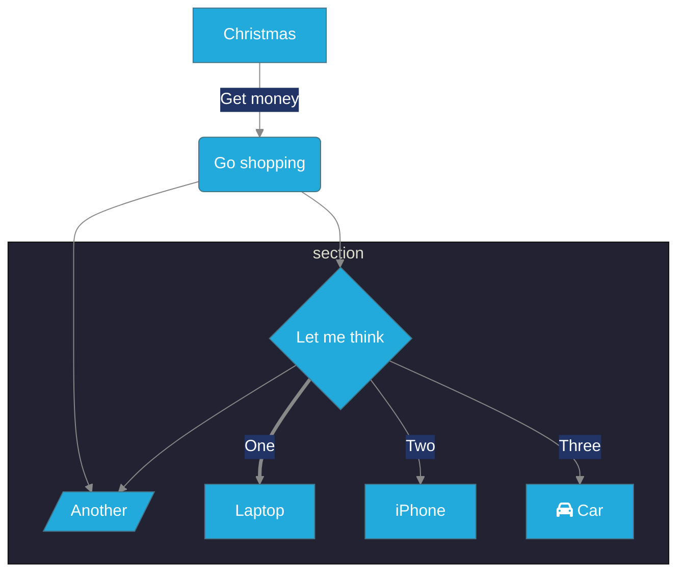
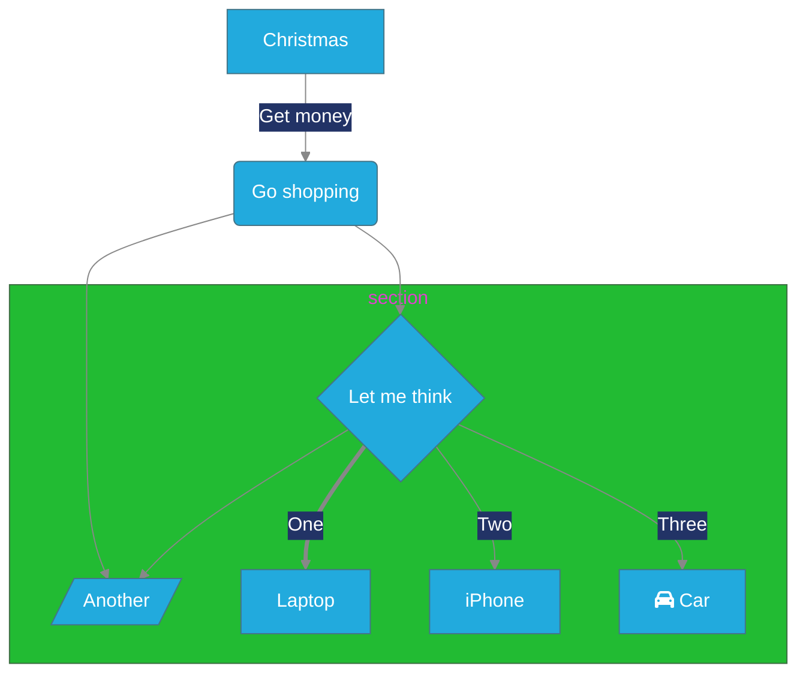

## 本文中所有图片链接都来自Oracle对象存储
可以修改的内容如下：



```javascript
    var reader = new commonmark.Parser();
    var writer = new commonmark.HtmlRenderer({ sourcepos: true });

    var render = function(parsed) {
        if (parsed === undefined) {
            return;
        }
        var startTime = new Date().getTime();
        var result = writer.render(parsed);
        document.getElementById("content").innerHTML=result;
    };
    var parseAndRender = function(text) {
        var parsed = reader.parse(text);
        render(parsed);
    };
```

### 只是这链接的生成太过繁琐。

[桶链接](https://objectstorage.ap-seoul-1.oraclecloud.com/p/Eop1uwUlGE1vEUnWq8t7x9gANSVcUrEVLryl3Ko1v84fZfK-fP0R_FbFQpm3WfU1/n/cnlim0eg821n/b/bucket-20220329-1150/o/)

桶中所有资源都只需要在桶链接的基础上加上文件名称即可访问。

> 桶链接为 https://objectstorage.ap-seoul-1.oraclecloud.com/p/IwOoBkMyTokP6KaF2zc1omfB4FLSz8VcOHhrliApCDIunfq48_zn6TZA8ouq1oCs/n/cnlim0eg821n/b/bucket-20220329-1150/o/


上图中对应的亮度增益为


可以看出，苹果对与亮度的处理还是非常细节。
上面亮度图使用iphone13pro拍摄的普通照片，格式采用兼容，则上面彩色途中的JPG中就会保存一张额外的亮度增益图，使用工具 exiftool 的命令

```shell
exiftool -b -"MPImage2" IMG_1058.JPG > mp1058.jpg
```
即可导出这张图，后续搞搞从heic中导出辅助图片的方法。